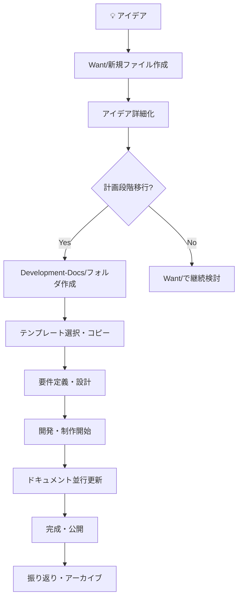

# 🎉 コンテンツ開発環境セットアップ完了！

## 作成したディレクトリ・ファイル一覧

### 📁 Want（作りたいものリスト）
- ✅ `README.md` - 詳細なガイドライン（既存を活用）
- ✅ `_TEMPLATE_Want-Item.md` - 新規プロジェクト用テンプレート（既存を活用）
- ✅ `PROJECT-WORKFLOW.md` - プロジェクト作成・管理ワークフロー（🆕追加）

### 📁 Development-Docs（開発ドキュメント）
- ✅ `README.md` - 全体概要（既存を活用）

#### 🛠️ テンプレート集
1. **Web-App-Template/** - Webアプリケーション用
   - ✅ `README.md` - プロジェクト概要・技術スタック
   - ✅ `Requirements.md` - 詳細な要件定義書

2. **Tool-Template/** - CLI・ライブラリ開発用
   - ✅ `README.md` - ツール開発の包括的ガイド

3. **API-Template/** - API・バックエンド開発用
   - ✅ `README.md` - API設計・実装の完全ガイド

4. **Content-Template/** - コンテンツ作成特化
   - ✅ `README.md` - コンテンツ戦略・制作フロー
   - ✅ `Writing-Guidelines.md` - 執筆ガイドライン

## 🚀 使い方（クイックスタート）

### 1. 新しいアイデアが浮かんだ時
```bash
# Wantディレクトリに移動
cd Want/

# テンプレートをコピーしてリネーム
cp _TEMPLATE_Want-Item.md "2025-06-18_Web-App_新しいプロジェクト.md"

# ファイルを編集してアイデアを記録
```

### 2. プロジェクトが計画段階に移行したら
```bash
# Development-Docsにフォルダ作成
mkdir "Development-Docs/新しいプロジェクト"

# 適切なテンプレートをコピー
cp -r "Development-Docs/_TEMPLATES/Web-App-Template/"* "Development-Docs/新しいプロジェクト/"
```

### 3. 開発しながらドキュメント更新
- `Development-Log.md` に日々の進捗を記録
- `Requirements.md` を詳細化
- 必要に応じて追加ドキュメントを作成

## 🎯 各テンプレートの特徴

### Web-App-Template
- **対象**: React/Vue/Next.js等のWebアプリ
- **特徴**: フロントエンド・バックエンド両方対応
- **含まれるもの**: 技術スタック、API設計、UI/UX要件

### Tool-Template
- **対象**: CLI、ライブラリ、VS Code拡張等
- **特徴**: 配布・パッケージングまで包括
- **含まれるもの**: コマンド設計、API設計、リリース戦略

### API-Template
- **対象**: REST API、GraphQL、マイクロサービス
- **特徴**: 本格的なAPIサービス開発向け
- **含まれるもの**: 認証、セキュリティ、スケーラビリティ

### Content-Template
- **対象**: ブログ記事、チュートリアル、技術書
- **特徴**: コンテンツ制作に特化
- **含まれるもの**: 執筆戦略、品質管理、プロモーション

## 🔄 ワークフロー概要



## 📊 プロジェクト管理のコツ

### タグ活用
```yaml
tags:
  - want                    # 必須
  - web-development         # 技術カテゴリ
  - priority-high          # 優先度
  - status-development     # 現在のステータス
  - learning               # 学習要素
```

### 定期レビュー
- **毎週月曜**: 新規アイデア整理、進捗確認
- **毎月第1週**: 完成プロジェクト整理、長期停滞見直し

### Obsidianプラグイン活用
- **Templater**: 自動テンプレート挿入
- **Kanban**: 進捗の可視化
- **Calendar**: 時系列での管理
- **Graph**: プロジェクト間の関連性把握

## 🎊 これで準備完了！

あなたのObsidianは以下が可能になりました：

✅ **アイデアの体系的管理** - Wantディレクトリで全てのアイデアを追跡  
✅ **段階的プロジェクト発展** - アイデア → 計画 → 開発 → 完成の流れ  
✅ **タイプ別最適化** - Web、Tool、API、Contentそれぞれに特化したテンプレート  
✅ **品質の担保** - 要件定義からテストまでの包括的ガイド  
✅ **効率的な開発** - 再利用可能なテンプレートとワークフロー  

早速新しいプロジェクトのアイデアをWantディレクトリに追加して、コンテンツ開発を始めてみてください！ 🚀

---

**セットアップ完了日**: 2025年6月18日  
**作成者**: Claude with taiki.amo
