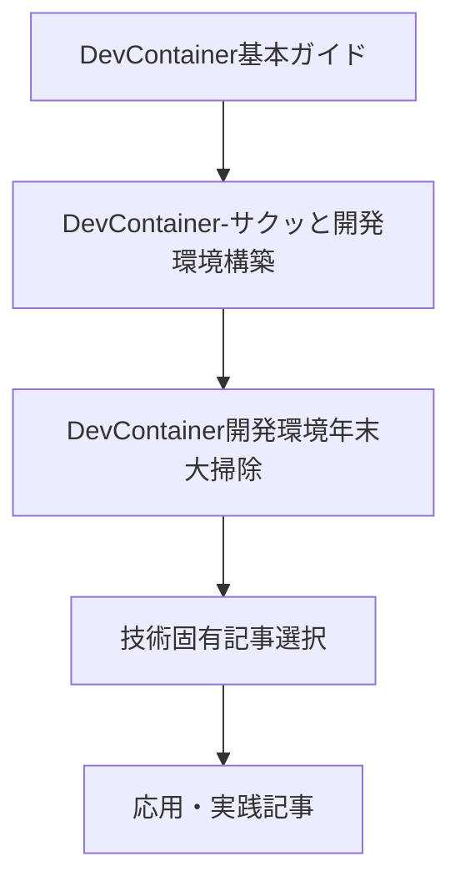
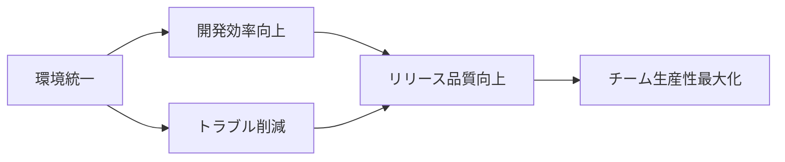
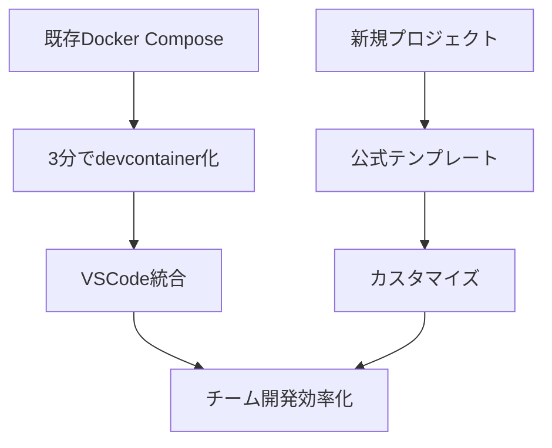
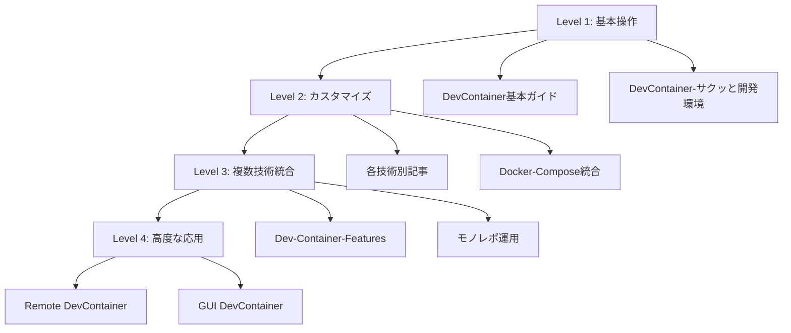
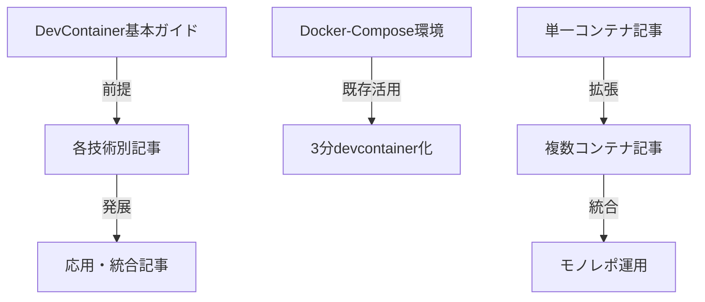
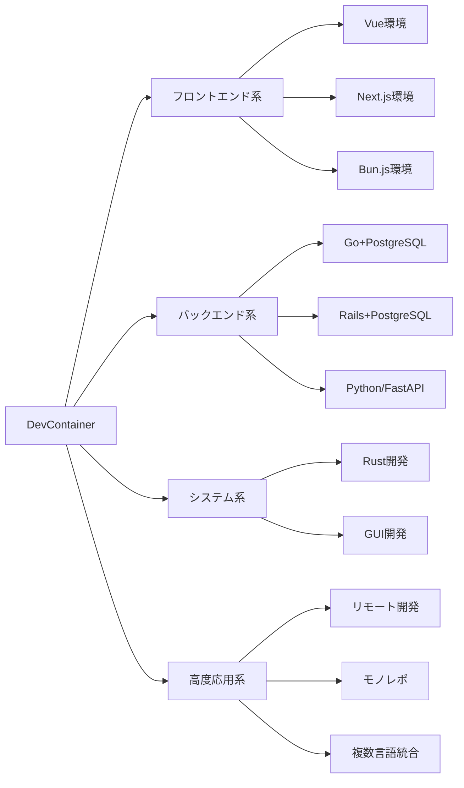

# カテゴリ別再分類

## 🗂️ 用途・目的別カテゴリ分類

### 📚 学習・入門カテゴリ

#### 初心者向け入門記事
| 記事名 | 学習目標 | 所要時間 | 前提知識 |
|--------|----------|----------|----------|
| [DevContainer基本ガイド-RustとNext.js](DevContainer基本ガイド-RustとNext.js.md) | DevContainerの基本操作 | 30分 | VSCode, Docker基本 |
| [DevContainer-サクッと開発環境構築](DevContainer-サクッと開発環境構築.md) | 3つの構築パターン理解 | 1時間 | Docker基礎知識 |
| [DevContainer開発環境年末大掃除](DevContainer開発環境年末大掃除.md) | ゼロからの環境構築学習 | 2時間 | なし（学習記録） |

#### 段階的学習パス

### 🛠️ 技術別専門カテゴリ

#### フロントエンド開発
| 記事名 | フレームワーク | 複雑度 | チーム適用 |
|--------|---------------|--------|------------|
| [Vue-TypeScript-Vite-DevContainer開発環境](Vue-TypeScript-Vite-DevContainer開発環境.md) | Vue.js + Vite | ⭐⭐⭐ | ⭐⭐⭐⭐⭐ |
| [WSL2+Docker-NextJS-MUI-TypeScript環境](WSL2+Docker-NextJS-MUI-TypeScript環境.md) | Next.js + MUI | ⭐⭐ | ⭐⭐⭐⭐ |
| [Docker+NextJS+Remote-Containers設定例](Docker+NextJS+Remote-Containers設定例.md) | Next.js | ⭐⭐ | ⭐⭐⭐ |
| [Bun.js+Docker+VSCode爆速開発環境](Bun.js+Docker+VSCode爆速開発環境.md) | Bun.js | ⭐⭐ | ⭐⭐⭐ |

**特徴分析**:
- **Vue環境**: 最新開発ツール完全統合
- **Next.js環境**: 豊富な設定例とパターン
- **Bun.js**: 次世代JavaScript実行環境

#### バックエンド開発
| 記事名 | 言語・FW | データベース | API開発 |
|--------|----------|-------------|---------|
| [DevContainer快適開発-Go+PostgreSQL](DevContainer快適開発-Go+PostgreSQL.md) | Go | PostgreSQL | ⭐⭐⭐⭐ |
| [DevContainer+Rails+PostgreSQL設定](DevContainer+Rails+PostgreSQL設定.md) | Ruby/Rails | PostgreSQL | ⭐⭐⭐⭐⭐ |
| [モノレポ複数devcontainer運用](モノレポ複数devcontainer運用.md) | Python/FastAPI | - | ⭐⭐⭐⭐ |

**推奨選択基準**:
- **Go**: シンプルなAPI、高パフォーマンス重視
- **Rails**: 機能豊富なWeb開発、チーム開発
- **FastAPI**: 現代的なPython Web開発

#### システムプログラミング
| 記事名 | 用途 | 学習曲線 | 実用性 |
|--------|------|----------|--------|
| [Dev-Container-Rust開発環境構築](Dev-Container-Rust開発環境構築.md) | 基本Rust開発 | ⭐⭐⭐ | ⭐⭐⭐⭐ |
| [Dev-Container-Tauri-GUI開発環境](Dev-Container-Tauri-GUI開発環境.md) | GUI開発 | ⭐⭐⭐⭐ | ⭐⭐⭐⭐⭐ |

### 🏢 チーム開発カテゴリ

#### 環境統一・標準化
| 記事名 | チーム規模 | 統一レベル | 導入コスト |
|--------|------------|------------|------------|
| [DevContainer+Rails+PostgreSQL設定](DevContainer+Rails+PostgreSQL設定.md) | 中〜大規模 | ⭐⭐⭐⭐⭐ | ⭐⭐⭐ |
| [Vue-TypeScript-Vite-DevContainer開発環境](Vue-TypeScript-Vite-DevContainer開発環境.md) | 小〜中規模 | ⭐⭐⭐⭐⭐ | ⭐⭐ |
| [Docker-Compose環境の3分devcontainer化](Docker-Compose環境の3分devcontainer化.md) | 既存チーム | ⭐⭐⭐ | ⭐ |

#### チーム開発メリット分析

### 🚀 高度・応用カテゴリ

#### 複数技術統合
| 記事名 | 統合レベル | 学習価値 | 実用性 |
|--------|------------|----------|--------|
| [Dev-Container-Features複数言語開発環境](Dev-Container-Features複数言語開発環境.md) | 複数言語 | ⭐⭐⭐⭐⭐ | ⭐⭐⭐⭐ |
| [モノレポ複数devcontainer運用](モノレポ複数devcontainer運用.md) | 複数サービス | ⭐⭐⭐⭐ | ⭐⭐⭐⭐⭐ |

#### 革新的アプローチ
| 記事名 | 革新度 | 技術的挑戦 | 将来性 |
|--------|--------|------------|--------|
| [Dev-Container-Tauri-GUI開発環境](Dev-Container-Tauri-GUI開発環境.md) | ⭐⭐⭐⭐⭐ | ⭐⭐⭐⭐ | ⭐⭐⭐⭐⭐ |
| [Remote-Dev-Containers最高環境](Remote-Dev-Containers最高環境.md) | ⭐⭐⭐⭐ | ⭐⭐⭐⭐ | ⭐⭐⭐⭐⭐ |

### 🔧 実用・効率化カテゴリ

#### 既存環境活用
| 記事名 | 移行コスト | 効果 | 推奨度 |
|--------|------------|------|--------|
| [Docker-Compose環境の3分devcontainer化](Docker-Compose環境の3分devcontainer化.md) | ⭐ | ⭐⭐⭐⭐ | ⭐⭐⭐⭐⭐ |
| [DevContainer-その他実用例まとめ](DevContainer-その他実用例まとめ.md) | ⭐⭐ | ⭐⭐⭐ | ⭐⭐⭐⭐ |

#### 効率化パターン

## 🎯 プロジェクト種別マッピング

### Webアプリケーション開発
#### 小規模・個人開発
**推奨記事**: DevContainer基本ガイド → WSL2+Docker-NextJS-MUI-TypeScript環境
**理由**: 学習コスト低、迅速な開発開始

#### 中規模・チーム開発
**推奨記事**: DevContainer+Rails+PostgreSQL設定 → Vue-TypeScript-Vite-DevContainer開発環境
**理由**: チーム統一、本格的開発環境

#### 大規模・企業開発
**推奨記事**: モノレポ複数devcontainer運用 → Remote-Dev-Containers最高環境
**理由**: スケーラビリティ、本番環境統一

### システム・ツール開発
#### CLI・ライブラリ開発
**推奨記事**: Dev-Container-Rust開発環境構築 → DevContainer快適開発-Go+PostgreSQL
**理由**: 高パフォーマンス、クロスプラットフォーム

#### GUI・デスクトップアプリ
**推奨記事**: Dev-Container-Tauri-GUI開発環境
**理由**: 革新的アプローチ、Web技術活用

### データ分析・AI開発
#### データ分析・可視化
**推奨記事**: DevContainer開発環境年末大掃除 → モノレポ複数devcontainer運用
**理由**: Python環境、Jupyter統合

#### 機械学習・AI
**推奨記事**: Dev-Container-Features複数言語開発環境
**理由**: 複数言語統合、GPU対応準備

## 📊 難易度・学習コスト分析

### 学習コスト階層

### 習得時間目安
| レベル | 習得期間 | 主要記事 | 得られるスキル |
|--------|----------|----------|---------------|
| **基本** | 1週間 | DevContainer基本ガイド | 基本操作、公式テンプレート利用 |
| **応用** | 2週間 | 技術別記事群 | カスタマイズ、チーム開発 |
| **発展** | 1ヶ月 | Features、モノレポ | 複数技術統合、大規模運用 |
| **専門** | 2ヶ月以上 | Remote、GUI記事 | 革新的手法、専門技術 |

## 🔄 記事間の関連性・依存関係

### 前提記事の関係

### 技術系統の分岐

## 💡 カテゴリ別活用提案

### 学習者向け活用
1. **入門者**: 基本ガイド → サクッと構築 → 興味のある技術別記事
2. **経験者**: Docker-Compose活用 → 応用記事 → 革新的手法

### 開発者向け活用
1. **個人開発**: 基本記事 → 技術特化記事
2. **チーム開発**: 環境統一記事 → 大規模運用記事
3. **企業開発**: 既存環境活用 → 本番統一記事

### 技術選択向け活用
1. **技術評価**: 技術別分類表参照
2. **導入計画**: カテゴリ別学習パス参照
3. **運用設計**: 実用・効率化記事参照

---
*目的に応じたカテゴリから最適な記事を選択してください*
